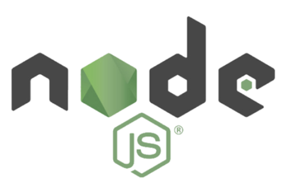
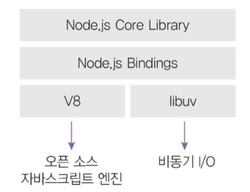

# 01. 노드 시작하기
## 1.1 핵심 개념 이해하기



### 학습 목표

- 런타임
- 이벤트 기반
- 논블로킹 I/O
- 싱글 스레드 모델

### NodeJS란 ?

<aside>

Node.js는 Chrome V8 JavaScript 엔진으로 빌드된 자바스크립트 런타임

</aside>

### Node의 활용

- 노드를 통해 다양한 자바스크립트 애플리케이션을 실행할 수 있으며, 대표적으로 서버 애플리케이션이 있다.

### 서버

> 네트워크를 통해 클라이언트에 요청에 서비스를 응답해주는 컴퓨터 또는 프로그램을 의미한다.
> 

### 런타임

Node.js는 자바스크립트 런타임이며 즉, 자바스크립트 실행기라고 할 수 있다.

[런타임](https://ko.wikipedia.org/wiki/%EB%9F%B0%ED%83%80%EC%9E%84)



노드의 내부 구조

V8과 libuv에 대해 간단히 알아보면

- V8: 구글이 개발한 자바스크립트 엔진이며, 오픈 소스로 공개되어 있다.
- libuv: C/C++로 구현되어 있으며, 이벤트 기반, 논블로킹 I/O 모델을 구현한 라이브러리

<aside>
ℹ️

추가적으로 번과 디노라는 자바스크립트 엔진도 있다.

</aside>

그러면 이제, libuv 라이브러리의 이벤트 기반, 논블로킹 I/O 모델이란 무엇인지 알아본다.

### 이벤트 기반

> 이벤트가 발생할 때 미리 지정해둔 작업을 수행하는 방식
> 

```jsx
button.addEventListener('click', () => { 
	console.log('click!') 
})
```

다음과 같은 코드가 존재할 때 

- button에 click이 발생했을 때 click!을 console에 출력하도록 이벤트 리스너를 추가해주고 있다.

이벤트로는 클릭, 네트워크 요청 등이 있으며, 이벤트 리스너에 콜백 함수를 전달하여 이벤트 발생 시 무엇을 할지 등록해야 한다.

그러면 여러 이벤트가 동시에 발생하면 어떻게 할까 ?

→ 이벤트 기반 모델에서는 이벤트 루프를 통해 어떤 순서로 콜백 함수를 호출할지 판단함

- 이벤트 루프
    - 이벤트 발생 시 호출할 콜백 함수 관리 및 실행 순서 결정
- 백그라운드
    - 타이머나 이벤트 리스너들이 대기하는 곳
- 태스트 큐
    - 이벤트가 발생하면 백그라운드에서 태스크 큐로 콜백 함수를 보냄

### 논블로킹 I/O

- 동시에 실행될 수 있는 작업
- 동시에 실행될 수 없는 작업

I/O (입력 / 출력) 작업

- 동시에 처리할 수 있음
- 파일 시스템 접근 / 네트워크 요청 등

이러한 I/O 작업은 논블로킹 방식으로 처리한다.

논블로킹

- 대기하기 않고 다음 작업 수행

블로킹

- 작업이 끝나야만 다음 작업 수행

Node는 이러한 논블로킹 작업을 백그라운드에 넘겨 동시에 처리한다.

```jsx
const longTask = () => {
	console.log('long task')
}

console.log('시작')
longTask()
console.log('끝')

// 시작
// long task
//  끝
```

```jsx
const longTask = () => {
	console.log('long task')
}

console.log('시작')
setTimeout(longTask, 0)
console.log('끝')

// 시작
//  끝
// long task
```

⇒ setTimeout을 이용하여 논블로킹으로 만듦

<aside>
🔥

논블로킹과 동시는 다른 의미

</aside>

[자바스크립트는 어떻게 동시성을 지원할까?](https://wslog.dev/js-event-loop)

### 싱글 스레드

우선, 싱글 스레드에 대해 알아보기 전 프로세스와 스레드에 대해 간략하게 알아본다.

- 프로세스
    - 운영체제에서 할당하는 작업의 단위이며 프로세스 간에는 메모리 등의 자원을 공유하지 않는다.
- 스레드
    - 프로세스 내에서 실행되는 흐름의 단위이며 프로세스는 여러 스레드를 생성하여 여러 작업을 동시에 처리할 수 있으며, 스레드는 부모 프로세스의 자원을 공유한다. 즉, 같은 주소의 메모리에 접근 가능하므로 데이터를 공유할 수 있다.

노드 → 프로세스

즉, 스레드 여러 개 생성 가능.

노드는 실제로 여러 스레드를 생성하지만, 코드로 직접 제어할 수 있는 스레드는 하나 

⇒ 싱글 스레드

<aside>
ℹ️

스레드 풀과 워커 스레드

노드가 싱글 스레드로 동작하지 않는 경우로 두 가지가 존재한다.

스레드 풀과 워커 스레드이다.

- 스레드 풀
    - 암호화 / 파일 입출력 / 압축 등과 같은 작업을 수행할 때 스스로 멀티 스레드를 사용함
- 워커 스레드
    - node 12 이상 버전
    - 직접 다수의 스레드를 다룰 수 있으며 CPU 연산이 많은 경우 워크 스레드를 사용할 수 있음.
</aside>

| 멀티 스레딩 | 멀티 프로세싱 |
| --- | --- |
| 하나의 프로세스 안에서 여러 개의 스레드 사용 | 여러 개의 프로세스 사용 |
| CPU 작업이 많이 사용될 때 사용 | I/O 요청이 많을 때 사용 |
| 프로그래밍이 어려움 | 비교적 쉬움 |

⇒ 노드는 다음의 이유로 멀티 프로세싱을 많이 활용한다.

결론적으로 노드는 싱글 스레드이므로 위의 예제는 실행 순서만 바뀔뿐 전체적인 시간은 비슷하다고 볼 수 있다. (논블로킹이라도 동시에 실행되지 않기 때문에)

## 1.2 서버로서의 노드

노드로 서버를 개발의 장단점은 노드의 장단점과 이어진다.

- 싱글 스레드
- 논블로킹 모델

싱글 스레드

→ I/O 작업을 논블로킹하며 스레드 하나가 많은 수의 I/O를 처리할 수 있음

→ CPU 연산이 많으면 적합하지 않음

네트워크나 데이터베이스, 디스크 작업 같은 I/O에 특화되어 있어 개수는 많지만, 크기는 작은 데이터를 실시간으로 주고받는 데 적합하다.

⇒ EX ) 실시간 채팅 애플리케이션 / 주식 차트 / JSON API

물론, 워커 스레드를 통해 멀티 스레드를 지원하지만, 느릴뿐만 아니라 프로그래밍이 어렵다.

CPU 연산이 많이 필요하다면 AWS Lambda 혹은 Google Cloud Functions 서비스를 이용하는 방법도 존재한다.

노드의 장점은 웹 서버가 내장되어 있어 입문하기 좋다는 것이다. 다른 언어는 별도 웹 서버나 웹 애플리케이션 서버를 추가로 설치해야 한다.

- 웹 서버
    - http 요청에 image / html / css / js 같은 정적인 컨텐츠를 제공
    - apache
    - nginx
    - IIS
- 웹 애플리케이션 서버
    - 요청에 맞게 동적으로 컨텐츠를 생성
    - 비즈니스 로직 / DB 조회 등을 수행
    - Tomcat

<aside>
ℹ️

따라서, 정적인 데이터 → 웹 서버

동적인 데이터가 필요하면 WAS에 요청하여 동적인 데이터를 만들어 받아오고 데이터 제공

</aside>

### 노드의 장단점

| 장점 | 단점 |
| --- | --- |
| 멀티 스레드 방식에 비해 적은 컴퓨터 자원 사용 | 기본적으로 싱글 스레드라서 CPU 코어를 하나만 사용 |
| I/O 작업이 많은 서버로 적합 | CPU 작업이 많은 서버로는 부적합 |
| 멀티 스레드 방식보다 쉬움 | 하나뿐인 스레드가 멈추지 않도록 관리 필요 |
| 웹 서버 내장 | 서버 규모가 커지면 서버를 관리하기 어려움 |
| 자바스크립트 사용 | 어중간한 성능 |
| JSON 형식과의 쉬운 호환 |  |
| 검증된 안정성 보안성 |  |

<aside>
ℹ️

정적인 콘텐츠를 제공하는 데 장점이 없지만, 넌적스, 퍼그, EJS 같은 템플릿 엔진을 통해 다른 언어와 비슷하게 콘텐츠를 제공할 수 있음.

</aside>

## 1.3 서버 외의 노드

Node 기반으로 많은 애플리케이션이 돌아가고 있다.

웹 프레임워크

- google → angular
- meta → react

모바일

- meta → react native

데스크톱

- electron (discord / atom / slack / vscode)

## 1.5 함께 보면 좋은 자료

- 노드 공식 문서
    
    https://nodejs.org/en
    

### 느낀점

- node의 내부 동작 (core / binding / V8 / libuv) 이런 것들을 처음 접했는데 매우 복잡한 구조로 되어있다는 것을 알게 되었다.
- 스레드 풀 / 워커 스레드 그리고 운영체제 단의 프로세스와 스레드에 대해 좀 더 공부해봐야겠다는 생각이 든다.
- react 등의 라이브러리도 결국 node를 기반으로 하는것을 알게 되었다.
- node를 통해 RN과 일렉트론도 개발할 수 있으니 나중에 한 번 도전해보면 좋을거 같다.