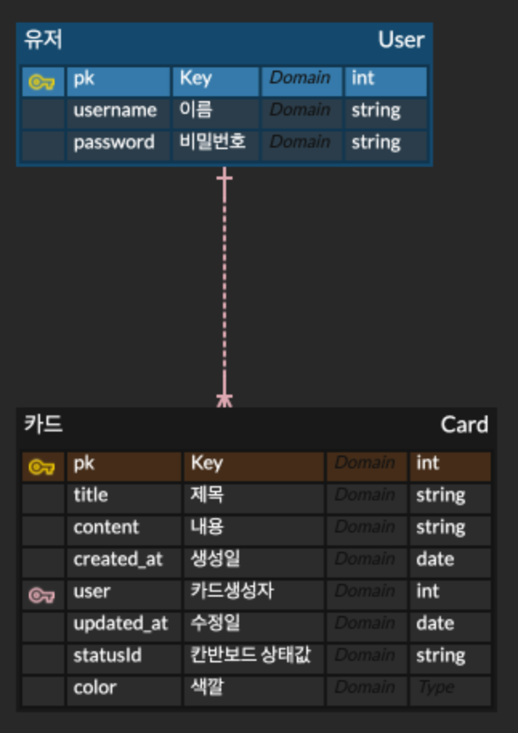

# Simple Kanban Board

### 기술스택

Front-End: React + TypeScript + React Hook Form
Back-End: Express + TypeScript + MySQL + Prisma

### 동기

NodeJS 교과서를 읽고 간단하게 express + MySQL + React 프로젝트를 해보면 좋겠다고 생각하여 진행하게 되었습니다.

### ℹ️
> 책에서는 MySQL + nunjucks + sequelize를 사용하는데, 
> 백엔드 개발자가 아닌 백엔드도 간단히 할 수 있는 개발자가 되기 위해 백엔드를 공부하고 있기 떄문에
> nunjucks 대신 React로 개발하고, 
> TypeScript와 호환성 mongoDB와 같은 noSQL뿐만 아니라 MySQL과 같은 RDBMS도 사용할 수 있어 sequelize가 아닌 prisma를 사용했습니다.

### 기능

- 로그인 
  - 우선, 사용자 개인 정보를 넣지 않고 로그인할 수 있는 방식으로 개발하고, 추후에 JWT를 적용하여 로그인을 완성할 예정입니다.

- 칸반보드
  - 쓰기
  - 조회하기
  - 삭제하기
  - 수정하기

* 이후에 추가적으로 드래그앤드랍 기능을 추가할 예정인데, CRUD 기능 구현에 초점을 맞춘 프로젝트이기 때문에 추가가 안 될 수 있습니다.

### ERD 설계




```prisma
model User {
  id Int @id @default(autoincrement())
  username String @unique
  password String
  cards Card[]
}

model Card {
  id Int @id @default(autoincrement())
  createdAt DateTime @default(now())
  updatedAt DateTime @updatedAt
  title String
  content String
  user User @relation(fields: [userId], references: [id])
  userId Int
  statusId Int
}
```

### API

GET /
POST /login 
- (회원가입이 필요하지 않습니다.)
GET /cards
POST /cards
PATCH /cards
DELETE /cards/:id

### 프로젝트 세팅

- express + typescript setting: https://spacebike.tistory.com/57
- eslint + prettier setting: https://medium.com/@pushpendrapal_/how-to-setup-node-js-with-typescript-eslint-and-prettier-46bd968a97ac

